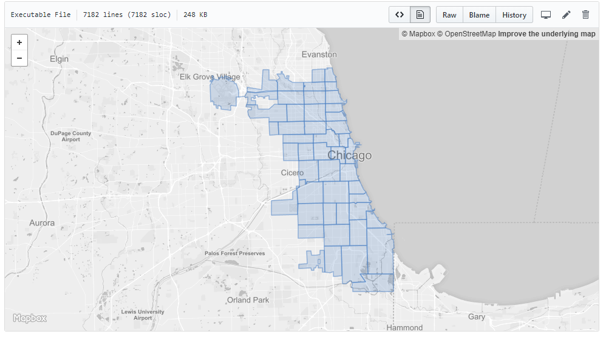

👶👧👩

What is <strong>TurfJS?</strong>

Advanced <strong>geospatial analysis</strong> for browsers and Node.js

<strong>Modular => </strong> 
Area, Bounding Box, Buffer, Grids, Intersect, Isolines, Length, Random, Sample, Voroni, Within...

JavaScript functions that speak <strong>GeoJSON</strong>

<strong>What</strong> is GeoJSON?

<pre><code>
/** GeoJSON is a single JSON file containing one or more features */
{
  "type": "FeatureCollection",
  "features": [
    {
      "type": "Feature",
      "geometry": {
        "type": "Point",
        "coordinates": [-82, 39] /*WGS 84*/
      },
      "properties": {
        "field": "value"
      }
    }
  ]
}
</code></pre>

GeoJSON is <strong>Everywhere</strong>

<em>

ArcGIS Feature to JSON</em> 
[USGS Earthquake Feed](https://earthquake.usgs.gov/fdsnws/event/1/)<strong>
DATA.GOV (1,600+ Datasets)</strong> <em>AGOL Query Response & Exports</em>
[geojson.xyz (Natural Earth Data+)](http://geojson.xyz)
<strong>Native Support in</strong> [QGIS](https://www.qgis.org/en/site/)

<h1>GitHub Support (2013)</h1>

Free & Open 

Source Software
[github.com/Turfjs](https://github.com/Turfjs)

# Include in your HTML
<pre><code>https://cdnjs.cloudflare.com/ajax/libs/Turf.js/5.1.5/turf.min.js</code></pre>
  
# Install via NodeJS  
<pre><code>npm install @turf/turf --OR-- npm install @turf/bbox</code></pre>

Why use <strong>TurfJS?</strong>

<strong>Simple geospatial queries</strong>

Complex geospatial analysis <strong>(in NodeJS)</strong>

Creating spatial metadata (bounding box)

A Few Examples

  Turf Within
  <pre><code>turf.booleanWithin(point, polygon)</code></pre>

<h1>Where am I?</h1>
<pre><code>
var result = "";
counties.features.map(function(county) {
  var point = turf.point([x,y]);
    if (turf.booleanWithin(point, county) {
      result = county.properties.NAME;
    }
});
</code></pre>

  <input type="text" class="form-input" value="-82,39">  <button class="btn btn-primary input-group-btn" id="withinSubmit">Submit</button>

Click the Submit button on the previous page

🤯😵🧐

🤨😭😕

  Practical Applications

  Local <strong>Authoritative</strong> Open Data

  Turf Nearest
  <pre><code>Array.filter()</code></pre>
  <pre><code>turf.nearestPoint(point, points)</code></pre>

# Find the Closest Playground
<pre><code>
var data = amenities.features.filter(function(a) {
  return a.properties.TYPE === 'Playground' 
})

var playgrounds = turf.featureCollection(data);

var result = turf.nearestPoint(point, playgrounds)
</code></pre>

  <input type="text" value="-82.007054,39.942022">  <button class="btn btn-primary input-group-btn" id="nearestSubmit">Submit</button>

Loading...

😍😍😍

Advanced Analysis in <strong>TurfJS</strong>

🐨😴💤

Visualizing <strong>Crashes</strong> in Muskingum County (>7k)

Hexgrids
<pre><code>turf.hexGrid(bbox, size, opts)</code></pre>
Intersect
<pre><code>turf.intersect(a,b)</code></pre>
Collect
<pre><code>turf.collect(p, pts, field, name)</code></pre>

<h1>Turf Hexgrids</h1>
<pre><code>
var bbox = [-82.5, 39.7, -81.5, 40.18];
var size = 1;
var options = {
  units: 'miles'
};

var hexgrid = turf.hexGrid(bbox, size, options)
</code></pre>

Turf Intersect 
<pre><code>
// loop through each grid
// add the intersecting areas to the clippedGrid
// calculate the area in sq miles

var clippedGrid = { "type":"FeatureCollection", "features":[] }

hexgrid.features.map(function(grid) {
  var toFt = 0.00000386102159
  var intersect = turf.intersect(grid, muskingum);
  if (intersect) {
    intersect.properties.area = (turf.area(intersect)) * toFt;
    clippedGrid.features.push(intersect);
  }
});
</code></pre>

  Turf Collect
  <pre><code>turf.collect(clippedGrid, crashes, "count", "total")</code></pre>

  
    

  

Turf in <strong>Node JS</strong>

Find the Nearest 🏕️ National Park

45MB GeoJSON Park Boundary File

<pre><code>var points = turf.explode(polygon)</code></pre>

<pre><code>turf.nearestPoint(point, points)</code></pre>

Query NodeJS
<form class="input-group">    
      <input class="form-input" name="lng" type="text" id="lng" placeholder="Longitude" value="-82">
    

    
      <input class="form-input" type="text" id="lat" placeholder="Latitude" name="lat" value="39">    
    <button class="btn btn-primary form-input" id="nearestPolySubmit" style="float:left;">Submit</button>
  </form>

No Node JS Server Running! Tested Benchmark ~ 2 seconds

<!--div>
Turf Center
<pre><code>
var center = {
  "type": "FeatureCollection",
  "features": []
};

/* Calculate the center for each grid */

hexgrid.features.map(function (feature) {
  center.features.push(turf.centerOfMass(feature));
});
</code></pre>
</div-->

No Coding
[Dropchop](http://dropchop.io/)

Support [TurfJS](https://opencollective.com/turf)

Thanks!
Malcolm Meyer
[@getbounds](https://twitter.com/getbounds)

